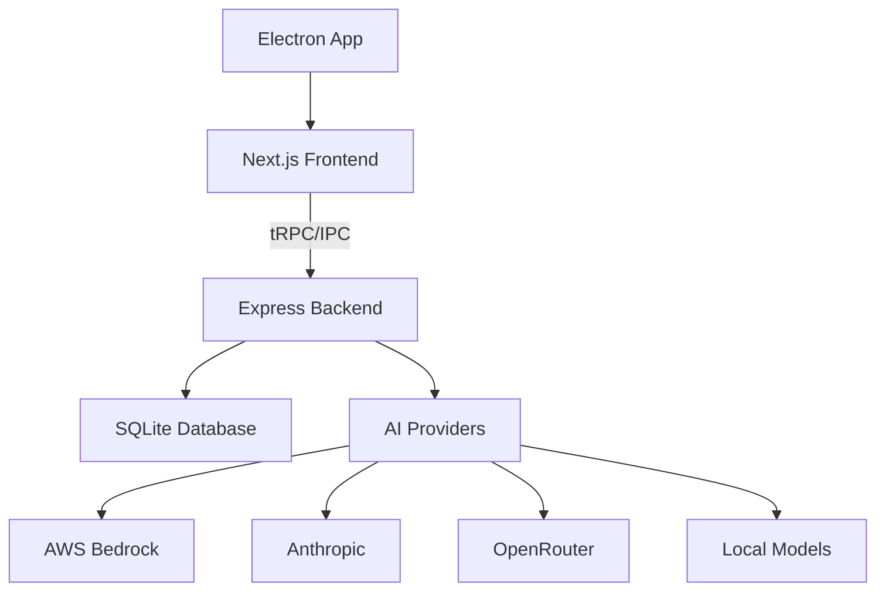
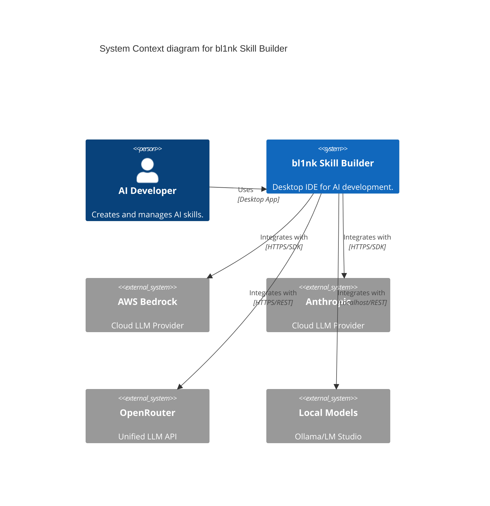
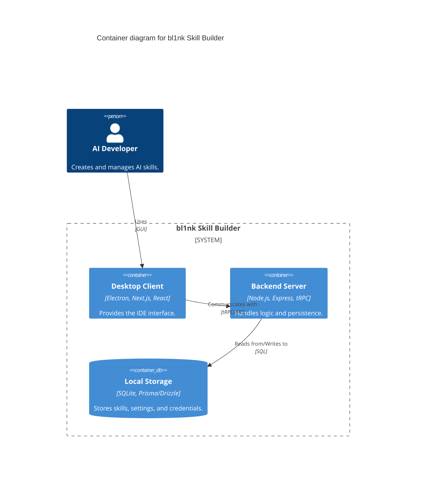

# Architecture Overview

## System Design
The bl1nk Skill Builder is designed as a desktop-first IDE using a monorepo structure. It leverages Electron to provide a native experience with a Next.js frontend and a Node.js backend.

## Architecture Layers
1.  **Presentation Layer (Next.js + React 19)**: Responsible for the UI/UX, including the skill editor (Monaco), chat interface, and settings.
2.  **API Layer (tRPC + REST)**: Provides type-safe communication between the frontend and backend.
3.  **Business Logic Layer**: Handles skill management, versioning, and multi-provider AI integration.
4.  **Data Layer (Prisma/Drizzle + SQLite)**: Manages persistence for skills, versions, and credentials.

## System Diagram

## System Context
The bl1nk Skill Builder interacts with various AI providers to facilitate the creation and testing of AI skills.

## Containers
The system is divided into two primary containers: the Client (UI & Electron) and the Server (Business Logic & Persistence).

