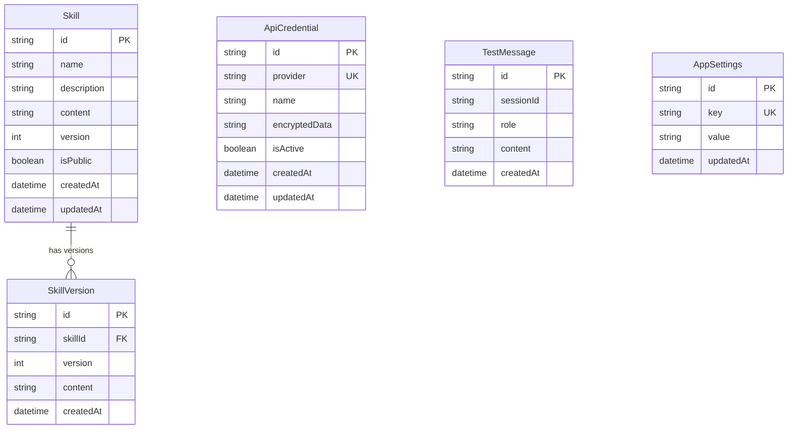

# Database Schema Reference

The bl1nk Skill Builder uses SQLite in Phase 1 for local desktop storage, managed via Prisma ORM.

## Entity Relationship Diagram

## Tables

### `Skill`
Stores the main skill definitions.
- `id`: CUID unique identifier.
- `name`: Name of the skill.
- `description`: Optional description.
- `content`: The prompt or instruction content.
- `version`: Current version number (increments on content change).

### `SkillVersion`
Snapshots of skill content for version history.
- `skillId`: Reference to the parent skill.
- `version`: Version number for this snapshot.
- `content`: Content of the skill at this version.

### `ApiCredential`
Encrypted API keys and configuration for AI providers.
- `provider`: Provider identifier (e.g., "bedrock", "openrouter").
- `encryptedData`: JSON object encrypted with AES-256-GCM.
- `isActive`: Whether this credential set is enabled.

### `TestMessage`
Ephemeral storage for testing sessions in the IDE.
- `sessionId`: Groups messages in a conversation.
- `role`: "user", "assistant", or "system".

### `AppSettings`
General application configuration stored as key-value pairs.
- `key`: Configuration key.
- `value`: JSON-serialized configuration value.
