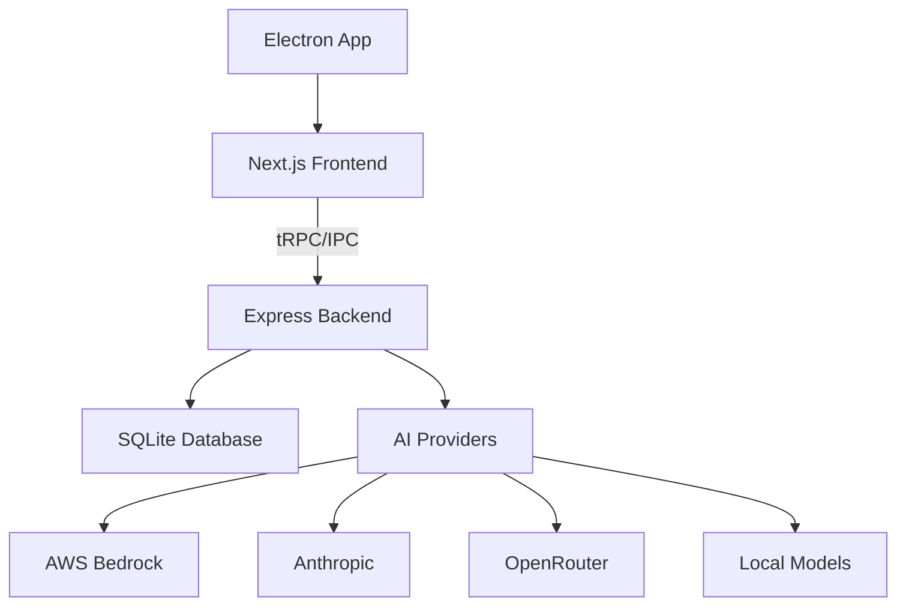
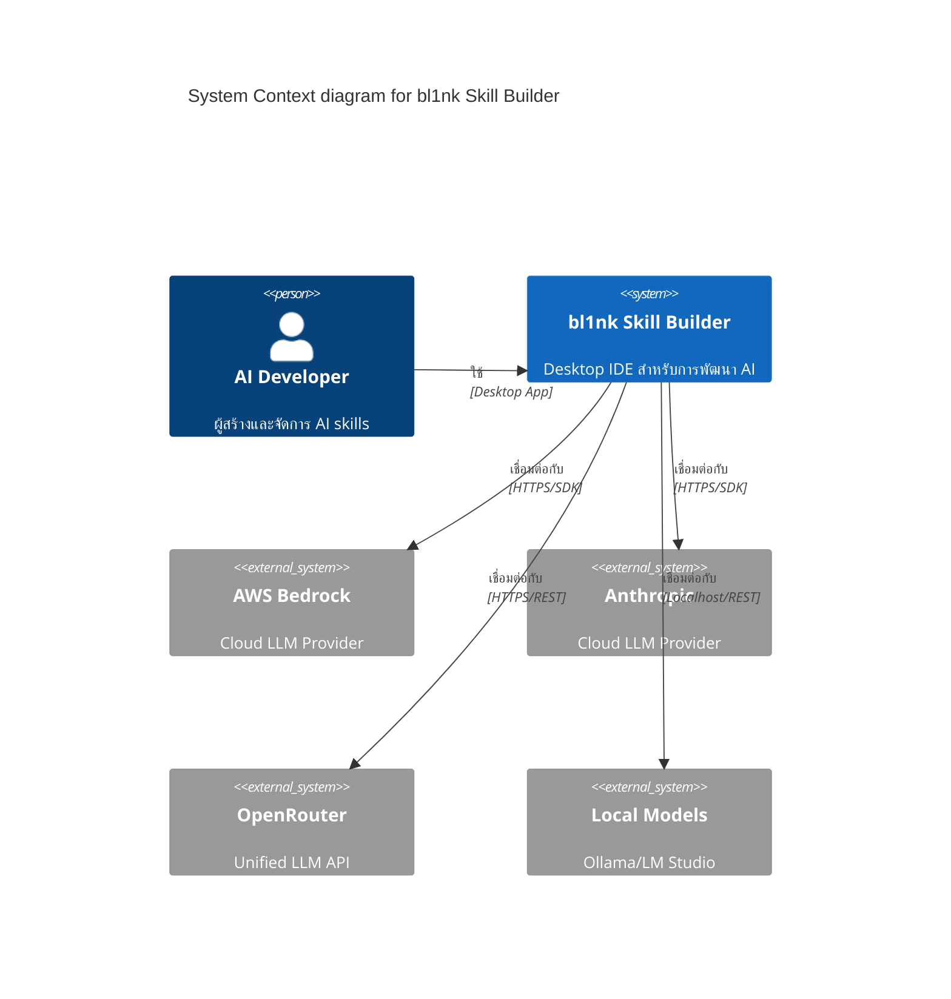
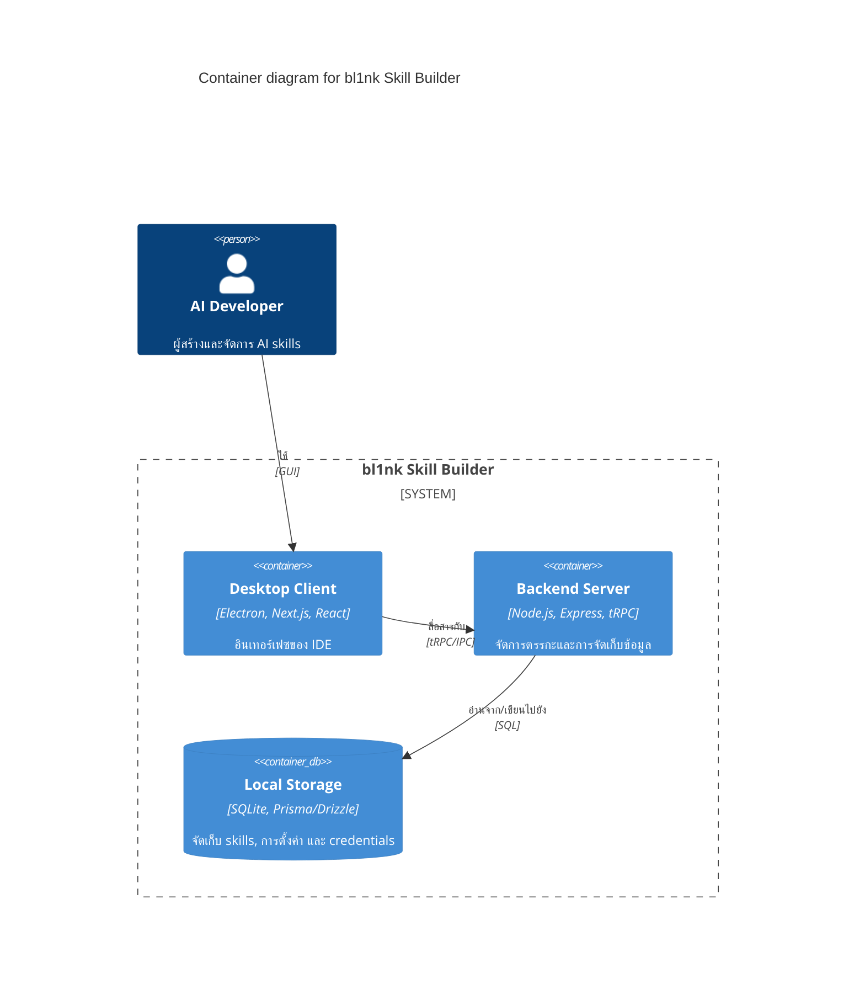

# ภาพรวมสถาปัตยกรรม

## การออกแบบระบบ
bl1nk Skill Builder ได้รับการออกแบบให้เป็น IDE แบบ desktop-first โดยใช้โครงสร้างแบบ monorepo ซึ่งใช้ประโยชน์จาก Electron เพื่อมอบประสบการณ์แบบ native พร้อมด้วย Next.js สำหรับ frontend และ Node.js สำหรับ backend

## ชั้นของสถาปัตยกรรม (Architecture Layers)
1.  **Presentation Layer (Next.js + React 19)**: รับผิดชอบส่วนติดต่อผู้ใช้ (UI/UX) รวมถึงตัวแก้ไข skill (Monaco), อินเทอร์เฟซการแชท และการตั้งค่า
2.  **API Layer (tRPC + REST)**: ให้บริการการสื่อสารแบบ type-safe ระหว่าง frontend และ backend
3.  **Business Logic Layer**: จัดการการจัดการ skill, การกำหนดเวอร์ชัน และการรวม AI เข้ากับหลาย provider
4.  **Data Layer (Prisma/Drizzle + SQLite)**: จัดการความคงอยู่ของข้อมูล (persistence) สำหรับ skill, เวอร์ชัน และข้อมูลรับรอง (credentials)

## แผนภาพระบบ (System Diagram)

## System Context
bl1nk Skill Builder ทำงานร่วมกับผู้ให้บริการ AI ต่างๆ เพื่ออำนวยความสะดวกในการสร้างและทดสอบ AI skills

## Containers
ระบบถูกแบ่งออกเป็นสองคอนเทนเนอร์หลัก: Client (UI & Electron) และ Server (Business Logic & Persistence)

