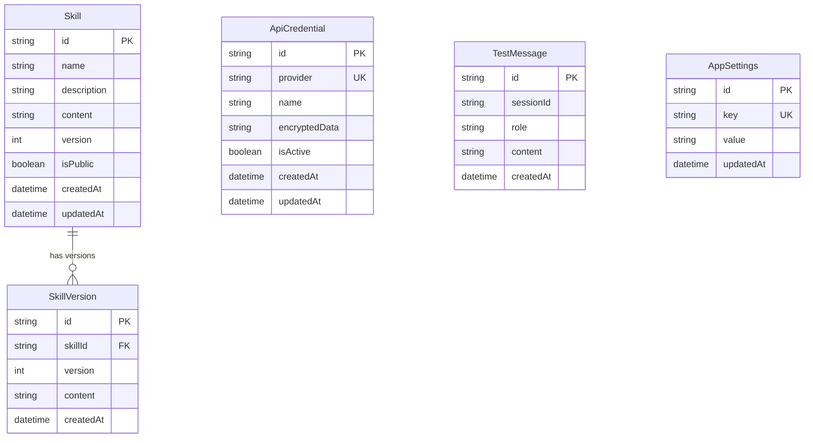

# Database Schema Reference

bl1nk Skill Builder ใช้ SQLite ในระยะที่ 1 (Phase 1) สำหรับการจัดเก็บข้อมูลในพื้นที่เครื่อง (local desktop) โดยจัดการผ่าน Prisma ORM

## แผนภาพความสัมพันธ์ของเอนทิตี (Entity Relationship Diagram)

## ตาราง (Tables)

### `Skill`
จัดเก็บคำจำกัดความหลักของ skill
- `id`: ตัวระบุเฉพาะ (CUID unique identifier)
- `name`: ชื่อของ skill
- `description`: คำอธิบาย (ไม่บังคับ)
- `content`: เนื้อหาของพรอมต์หรือคำสั่ง
- `version`: หมายเลขเวอร์ชันปัจจุบัน (เพิ่มขึ้นเมื่อมีการเปลี่ยนแปลงเนื้อหา)

### `SkillVersion`
บันทึกภาพรวม (snapshot) ของเนื้อหา skill สำหรับประวัติเวอร์ชัน
- `skillId`: อ้างอิงไปยัง skill หลัก
- `version`: หมายเลขเวอร์ชันสำหรับ snapshot นี้
- `content`: เนื้อหาของ skill ในเวอร์ชันนี้

### `ApiCredential`
จัดเก็บ API keys ที่ถูกเข้ารหัสและการกำหนดค่าสำหรับผู้ให้บริการ AI
- `provider`: ตัวระบุผู้ให้บริการ (เช่น "bedrock", "openrouter")
- `encryptedData`: วัตถุ JSON ที่เข้ารหัสด้วย AES-256-GCM
- `isActive`: สถานะการเปิดใช้งานข้อมูลรับรองชุดนี้

### `TestMessage`
การจัดเก็บข้อมูลชั่วคราวสำหรับเซสชันการทดสอบใน IDE
- `sessionId`: จัดกลุ่มข้อความในการสนทนา
- `role`: "user", "assistant" หรือ "system"

### `AppSettings`
การกำหนดค่าทั่วไปของแอปพลิเคชันที่จัดเก็บในรูปแบบ key-value pairs
- `key`: ชื่อการกำหนดค่า
- `value`: ค่าการกำหนดค่าที่ถูกแปลงเป็น JSON string
